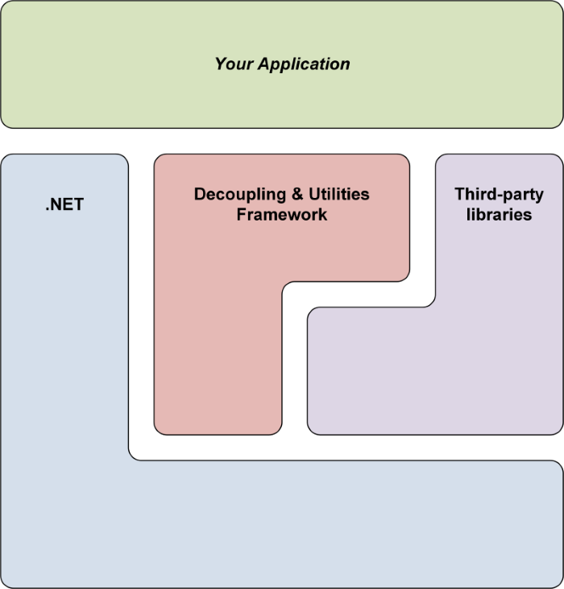
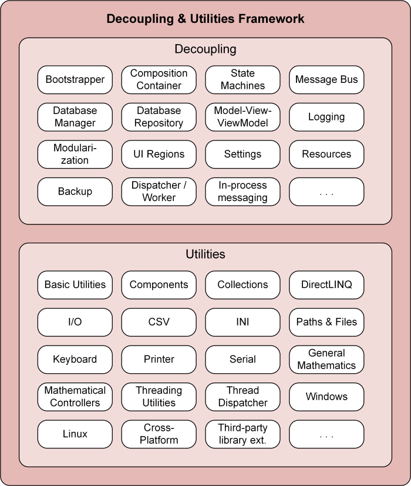

# Decoupling & Utilities Framework

A framework for .NET, Mono, and Unity.

## Releases

[Changelog](CHANGELOG.md)

*no release yet*

## Overview

The Decoupling & Utilities Framework is a collection of various functions for different .NET flavours.

In general, it contains functions to help you...
 * ...reduce the amount of boilerplate code you need to write
 * ...decouple your application components/modules and make your codebase more maintainable and extensible
 * ...add functionality to your application by providing implementations for application infrastructure and services
 * ...save time by providing functionality not part of .NET or third-party libraries

All those functions are mostly independent of each other and can be used individually.
So you can simply ignore functions you do not want to use.

The "utilities" part implements general-purpose functionality not tied to a particular application type.
Therefore, the target audience of this framework can be everyone who develops for one of the .NET flavours.

The "decoupling" part on the other hand has a more narrower target audience as it focuses on functionality common to the following application types:

 * Desktop applications
 * Desktop games
 * Server applications

Usually, the "decoupling" functionalities are used as cross-cutting concerns while the "utilities" functionalities are used selective and isolated.

## Documentation

Each [release](README.md) contains an API documentation about its assemblies, namespaces, types, and members.

The version history is documented in the [changelog](CHANGELOG.md).

The project itself and its structure and organization is described in the [project documentation](DOCUMENTATION.md).

## Contribution & Issues

See [contribution documentation](CONTRIBUTING.md) if you wish to report [issues](https://github.com/RotenInformatik/RI_Framework/issues) or contribute to the project trough [pull requests](https://github.com/RotenInformatik/RI_Framework/pulls).

## License

The Decoupling & Utilities Framework uses its own license, the [Roten Informatik Framework License 1.0](LICENSE.txt), which is mostly based on the [Apache 2.0 License](https://choosealicense.com/licenses/apache-2.0/).
